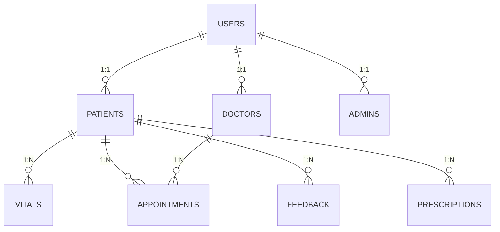

# 🌟 Remote Patient Monitoring System (RPMS)

*A comprehensive Java-based telemedicine platform with real-time monitoring, secure communication, and health analytics*

---

## 🚀 Key Features

### 👨‍⚕️ **Doctor Portal**
- **Real-time Patient Monitoring**: Track vital signs with threshold alerts
- **Secure Telemedicine**: Encrypted video consultations and messaging
- **e-Prescriptions**: Digital prescription management with reminders
- **Appointment Scheduling**: Calendar integration with automated reminders

### 🏥 **Patient Portal**
- **Health Data Upload**: CSV import for vital signs
- **Emergency Alerts**: One-touch panic button with SMS/email notifications
- **Medical History**: Centralized access to all health records
- **Trend Visualization**: Interactive charts for health metrics

### 👨‍💼 **Admin Console**
- **User Management**: CRUD operations for all user types
- **System Analytics**: Usage statistics and logs
- **Role-based Access**: Fine-grained permission control

---

## 🛠️ Technical Stack

| Component          | Technology                          |
|--------------------|-------------------------------------|
| **Core Framework** | Java 17, JavaFX                     |
| **Database**       | MySQL 8.0                          |
| **Security**       | Basic Auth (to be upgraded to JWT)  |
| **Notifications**  | Jakarta Mail, Twilio SMS            |
| **Data Parsing**   | OpenCSV                            |
| **Charts**         | JavaFX Charts                      |
| **Build Tool**     | Maven                              |

---

## 📦 Dependency Management

### Maven Configuration
```xml
<!-- Database -->
<dependency>
    <groupId>mysql</groupId>
    <artifactId>mysql-connector-java</artifactId>
    <version>8.0.33</version>
</dependency>

<!-- Email -->
<dependency>
    <groupId>com.sun.mail</groupId>
    <artifactId>jakarta.mail</artifactId>
    <version>2.0.1</version>
</dependency>

<!-- HTTP Client -->
<dependency>
    <groupId>org.apache.httpcomponents</groupId>
    <artifactId>httpclient</artifactId>
    <version>4.5.13</version>
</dependency>

<!-- JavaFX -->
<dependency>
    <groupId>org.openjfx</groupId>
    <artifactId>javafx-controls</artifactId>
    <version>20</version>
</dependency>

<!-- Twilio (optional) -->
<dependency>
    <groupId>com.twilio.sdk</groupId>
    <artifactId>twilio</artifactId>
    <version>9.2.3</version>
</dependency>
```

### Manual JAR Downloads
For manual installation, download these required JARs:

1. **Jakarta Mail**
   - [jakarta.mail-2.0.1.jar](https://repo1.maven.org/maven2/com/sun/mail/jakarta.mail/2.0.1/jakarta.mail-2.0.1.jar)
   - [jakarta.activation-2.0.1.jar](https://repo1.maven.org/maven2/com/sun/activation/jakarta.activation/2.0.1/jakarta.activation-2.0.1.jar)

2. **MySQL Connector**
   - [mysql-connector-j-8.0.33.jar](https://repo1.maven.org/maven2/com/mysql/mysql-connector-j/8.0.33/mysql-connector-j-8.0.33.jar)

3. **Twilio**
   - [twilio-9.2.3.jar](https://repo1.maven.org/maven2/com/twilio/sdk/twilio/9.2.3/twilio-9.2.3.jar)

4. **JavaFX SDK**
   - [Download JavaFX 20](https://gluonhq.com/products/javafx/)

---

## 🚀 Quick Start Guide

### 1. Prerequisites
- Java 17+ ([Download](https://adoptium.net/))
- MySQL 8.0+ ([Download](https://dev.mysql.com/downloads/))
- Maven 3.8+ ([Download](https://maven.apache.org/download.cgi))

### 2. Database Setup
```bash
# Create database
CREATE DATABASE hospitalmanagementsystem;

# Import schema
mysql -u root -p hospitalmanagementsystem < sql/setup.sql
```

### 3. Configuration
Create `.env` file:
```env
DB_URL=jdbc:mysql://localhost:3306/hospitalmanagementsystem
DB_USER=root
DB_PASS=yourpassword
SMTP_HOST=smtp.gmail.com
SMTP_PORT=587
SMTP_USER=your@gmail.com
SMTP_PASS=your-app-password
```

### 4. Build & Run
```bash
git clone https://github.com/Ailya-Shah/OOP-PROJECT2025
cd OOP-PROJECT2025
mvn clean install
mvn javafx:run
```


## 🔧 Troubleshooting

| Issue | Solution |
|-------|----------|
| MySQL Connection Failed | Verify credentials and service status |
| Email Not Sending | Check SMTP settings and enable less secure apps |
| JavaFX Errors | Ensure correct Java version and module path |

---

## 📊 Database Schema



---

## ✉️ Contact
Project Team:
- Ailya Zainab
- Luqman Shehzad  
- Muhammad Hassan

Repository: [https://github.com/Ailya-Shah/OOP-PROJECT2025](https://github.com/Ailya-Shah/OOP-PROJECT2025)

---

*"Innovating healthcare through secure technology"* 🚑💻
```

